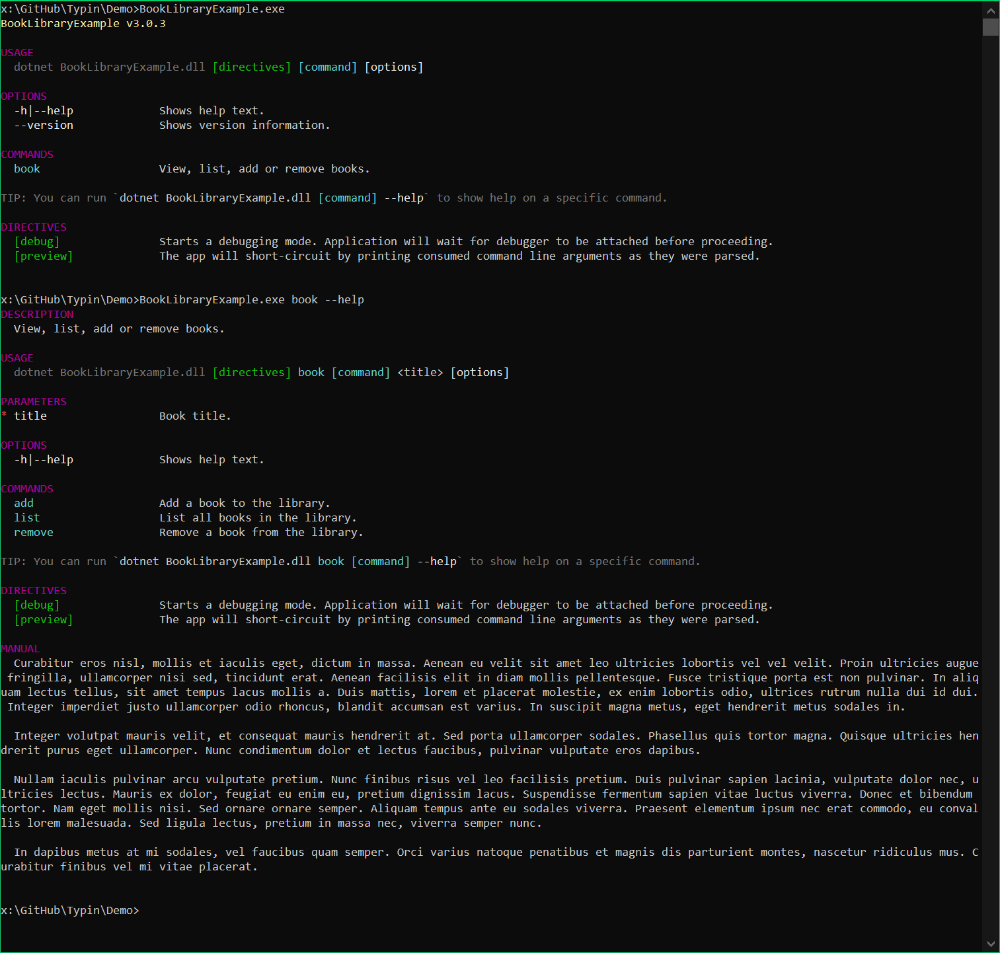

# Typin

<p align="center">

[](https://github.com/adambajguz/Typin/actions)
[](https://codecov.io/gh/adambajguz/Typin)
[](https://nuget.org/packages/Typin)
[](https://nuget.org/packages/Typin)

</p>

<table>
 <tr>
    <td>
      <p align="center">
        
      </p>
    </td>
    <td>

<b>Table of contents</b>

- [Typin](#typin)
  - [Features](#features)
  - [Installing Typin](#installing-typin)
  - [Documentation](#documentation)
  - [Screenshots](#screenshots)
  - [Benchmarks](#benchmarks)
  
  </td>
 </tr>
</table>


**Typin** is a simple to use, yet powerful framework for building both interactive command line applications and command line tools. 

> **Etymology:** Typin is made out of "Typ" for "Type" and "in" for "interactively". It's pronounced as "Type in".

It is build based on the code of [CliFx](https://github.com/Tyrrrz/CliFx). Its primary goal is to completely take over the user input layer, letting you forget about the infrastructure and instead focus on writing your application.
This framework uses a declarative class-first approach for defining commands, avoiding excessive boilerplate code and complex configurations.

An important property of Typin, when compared to some other libraries, is that it's not just a parser -- it's a complete application framework.
The main goal of the library is to provide a consistent and enjoyable development experience when building command line applications.

## Features

- Complete application framework, not just an argument parser
- Requires minimal amount of code to get started
- Configuration via attributes
- Handles conversions to various types, including custom types
- Supports multi-level command hierarchies
- Supports interactive mode
- Intuitive auto-completion (Tab / Shift + Tab) in interactive mode.
- Intuitive command history (Up and Down arrows) in interactive mode, accessible also from user code.
- Exposes raw input, output, error streams to handle binary data
- Allows graceful command cancellation
- Prints errors and routes exit codes on exceptions
- Provides comprehensive and colorful auto-generated help text
- Highly testable and easy to debug
- Comes with built-in analyzers to help catch common mistakes
- Targets .NET Standard 2.0+
- Uses `Microsoft.Extensions.DependencyInjection` but no other external dependencies

## Installing Typin

You should install [Typin with NuGet](https://www.nuget.org/packages/Typin):

    Install-Package Typin
    
Or via the .NET Core command line interface:

    dotnet add package Typin

Either commands, from Package Manager Console or .NET Core CLI, will download and install Typin and all required dependencies.

## Documentation

See [wiki](https://github.com/adambajguz/Typin/wiki) for detailed instructions and documentation.

## Screenshots



## Benchmarks

Here's how Typin's execution overhead compares to that of other libraries.

```ini
BenchmarkDotNet=v0.12.0, OS=Windows 10.0.18363
Intel Core i7-4790 CPU 3.60GHz (Haswell), 1 CPU, 8 logical and 4 physical cores
.NET Core SDK=3.1.302
  [Host]     : .NET Core 3.1.6 (CoreCLR 4.700.20.26901, CoreFX 4.700.20.31603), X64 RyuJIT
  DefaultJob : .NET Core 3.1.6 (CoreCLR 4.700.20.26901, CoreFX 4.700.20.31603), X64 RyuJIT
```

|                               Method |         Mean |     Error |    StdDev | Ratio | RatioSD | Rank |
|-------------------------------------:|-------------:|----------:|----------:|------:|--------:|-----:|
|                    CommandLineParser |     2.278 us | 0.0065 us | 0.0054 us |  0.02 |    0.00 |    1 |
|                                CliFx |    46.173 us | 0.2461 us | 0.2302 us |  0.46 |    0.01 |    2 |
|                                Typin |   101.267 us | 1.0089 us | 0.8943 us |  1.00 |    0.00 |    3 |
|                                Clipr |   126.073 us | 0.6684 us | 0.5581 us |  1.25 |    0.01 |    4 |
| McMaster.Extensions.CommandLineUtils |   126.572 us | 0.2780 us | 0.2600 us |  1.25 |    0.01 |    4 |
|                   System.CommandLine |   192.502 us | 0.5573 us | 0.4940 us |  1.90 |    0.02 |    5 |
|                            PowerArgs |   243.405 us | 0.8565 us | 0.7152 us |  2.40 |    0.02 |    6 |
|                               Cocona | 1,132.327 us | 8.5110 us | 7.5448 us | 11.18 |    0.10 |    7 |

Legends:
  * Mean    : Arithmetic mean of all measurements
  * Error   : Half of 99.9% confidence interval
  * StdDev  : Standard deviation of all measurements
  * Ratio   : Mean of the ratio distribution ([Current]/[Baseline])
  * RatioSD : Standard deviation of the ratio distribution ([Current]/[Baseline])
  * Rank    : Relative position of current benchmark mean among all benchmarks (Arabic style)
  * 1 us    : 1 Microsecond (0.000001 sec)
